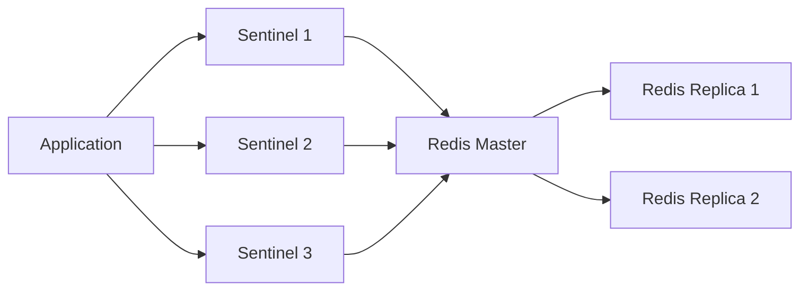
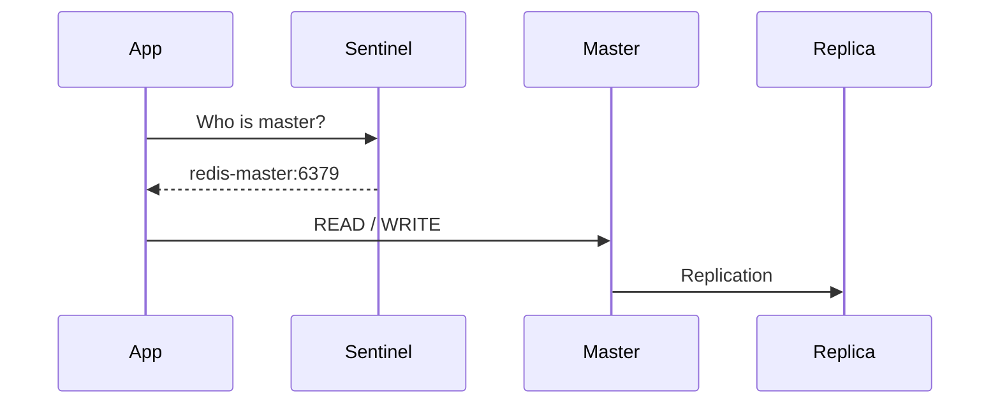
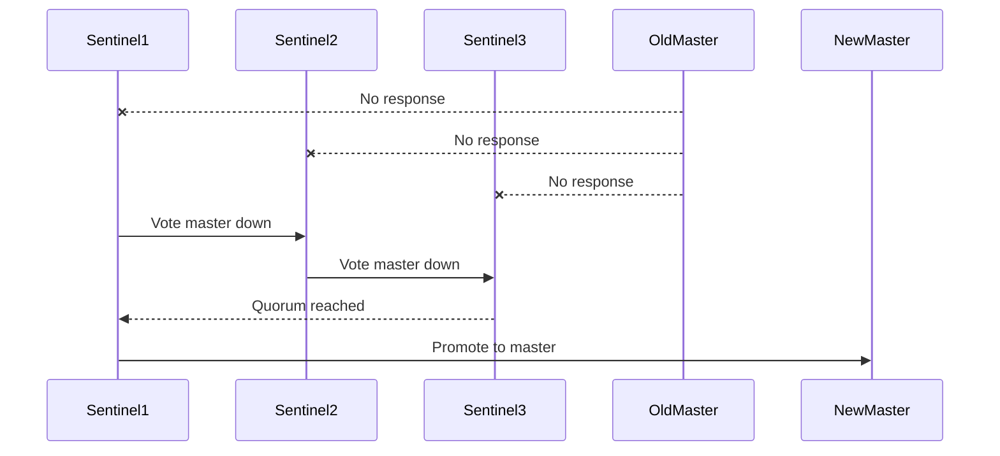
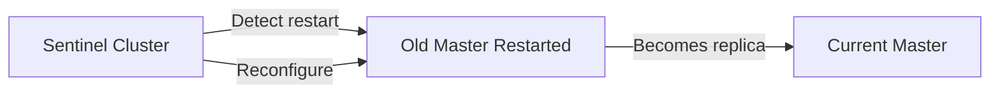

# Redis Sentinel Production-Grade Setup (Docker)

## 📌 Overview

This repository demonstrates a **production-ready Redis high-availability setup** using:

* **Redis Master**
* **Redis Replicas**
* **Redis Sentinel Cluster**
* **Docker & Docker Compose**

The goal is to ensure:

* Automatic **failover**
* Zero manual intervention after crashes or restarts
* Safe **self-healing**
* Client applications always connect to the **current master**

---

## 🎯 Why This Setup Exists

Redis alone is **not highly available**.

If a single Redis instance fails:

* Writes stop
* Applications break
* Manual recovery is required

This setup solves that by using **Redis Sentinel**.

---

## 🧠 What Each Component Does

### 🔴 Redis Master

* Handles **all WRITE operations**
* Replicates data to replicas
* Only **one master exists at a time**

---

### 🟢 Redis Replicas

* Receive replicated data from the master
* Can be promoted to master during failure
* Used for **failover**, not writes

---

### 🟡 Redis Sentinel

Sentinel is the **brain of the system**.

It:

* Monitors Redis instances
* Detects failures
* Performs leader election
* Promotes a replica to master
* Reconfigures the cluster automatically

> ⚠️ Applications **must never connect directly to Redis**
>
> They must connect **via Sentinel**

---

## 🏗 Architecture Diagram



---

## 🔄 Normal Operation Flow



---

## 🚨 Failure & Automatic Failover



✅ No human action
✅ No data loss
✅ No split-brain

---

## 🔁 Restart & Self-Healing Behavior



✔ Restarted master **never steals leadership**
✔ Automatically joins as replica
✔ 100% safe

---

## 📦 Prerequisites

* Docker ≥ 20.x
* Docker Compose ≥ v2
* Linux / macOS / Windows (WSL recommended)

---

## ▶️ How to Run the Cluster

### 1️⃣ Clone the repository

```bash
git clone <your-repo-url>
cd redis-production-grade-structure
```

---

### 2️⃣ Start everything

```bash
docker compose up -d
```

---

### 3️⃣ Verify containers

```bash
docker ps
```

You should see:

* 1 Redis master
* 2 Redis replicas
* 3 Redis sentinels

---

## 🧪 How to Test Failover

### ❌ Kill the master

```bash
docker stop redis-master
```

---

### ✅ Observe automatic promotion

```bash
docker logs sentinel-1
```

You will see:

* Master marked down
* Replica promoted
* New master elected

---

### 🔁 Restart old master

```bash
docker start redis-master
```

Result:

* Old master becomes a **replica**
* No manual commands required

---

## 🧪 How to Verify Sentinel State

```bash
docker exec -it sentinel-1 redis-cli -p 26379 sentinel masters
```

```bash
docker exec -it sentinel-1 redis-cli -p 26379 sentinel slaves mymaster
```

---

## ⚠️ Common Mistakes (Avoid These)

❌ Connecting app directly to Redis
❌ Hardcoding Redis IP
❌ Using a single Sentinel
❌ Expecting master to restart as master

---

## ✅ Best Practices Followed

* Minimum **3 Sentinels** (odd number)
* No static Redis endpoints
* Quorum-based failover
* Safe restarts
* Docker-network DNS isolation

---

## 📚 Summary

| Feature              | Supported |
| -------------------- | --------- |
| Automatic failover   | ✅         |
| Self-healing         | ✅         |
| Zero manual recovery | ✅         |
| Docker ready         | ✅         |
| Production safe      | ✅         |

---

## 📌 Final Notes

This setup mirrors **real-world production Redis HA** used in:

* Payment systems
* Session stores
* Distributed locks
* Rate limiters
